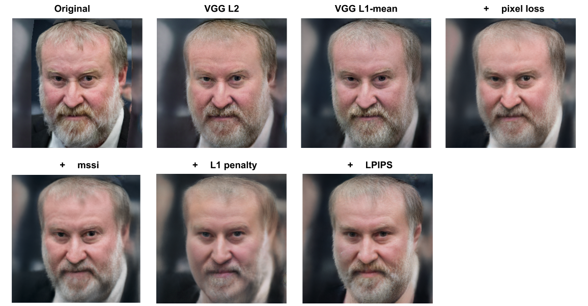

# familyGan

Benchmarking stylegan_plus
 - [X] ResNet
 - [X] image loss using logcosh (VGG16 perceptual model)
 - [X] MS-SIM loss (VGG16 perceptual model)
 - [X] LPIPS loss (VGG16 perceptual model)
 - [ ] floating point 16bit
 - [ ] face mask
 - [ ] tiled dlatents

Status:
- [X] Stochastic clipping and best latent
- [ ] Serve resnet and/or stylegan_encoder in different standalone processes

some references:
- [Conditional GAN blog](https://medium.com/towards-artificial-intelligence/face-aging-using-conditional-gans-an-introduction-to-age-cgans-machine-learning-8a4a6a100201)
- [ChildGAN that didn't end up well](https://github.com/mingu600/childGAN)
- [Another ChildGAN that didn't end up well](https://github.com/munozalexander/Child-Face-Generation)
- [image2styletransfare GAN](https://arxiv.org/abs/1904.03189)

Datasets:
- [Fiwkinship](https://web.northeastern.edu/smilelab/fiwkinship) - try downloading from this [link](https://www.google.com/url?q=https://1drv.ms/u/s!AkDk_XdBkJ9whlQQkd2rOXSREro-&sa=D&ust=1567577791511000&usg=AFQjCNFUuKCPHpFajsnMWXgNKNq2eHVo4A). I didn't succeed in downloading it.
  - try also [here](https://docs.google.com/forms/d/e/1FAIpQLSd5_hbg-7QlrqE9V4MJShgww308yCxHlj6VOLctETX6aYLQgg/formResponse)
- [TSKinFace](http://parnec.nuaa.edu.cn/xtan/data/TSKinFace.html)

Code:
- [stylegan-encoder](https://github.com/spiorf/stylegan-encoder)

## StyleGan Benchmarking

on toydata 1 (Mandelblit) loss < 0.6

| description                                     | timing [sec]|  iter  |
|-------------------------------------------------|-------------|--------|
| init version (hackaton)                         |    299      |  750   |
| + Adam + lr 2.0 + early stopping                |    71.6     |   91   |
| + oracle init dlatent (start from final dlatent)|    48.68    |   42   |
|    + resnet init dlatent                        |    73.8     |   74   |

early stopping delta 0.1 with 60 stop count. Losses are changed so *do not compared according to las column*

| description                                     | timing [sec]|  iter  |  loss |
|-------------------------------------------------|-------------|--------|-------|
| Original VGG loss with L2 VGG loss              |    101.07   |  176   | 0.412 |
| Original VGG loss with (L1 - mean) VGG loss     |    125.58   |  250   | 74.80 |
| 0.4 X VGG_loss + 1.5 X pixel_loss               |    126.00   |  250   | 46.81 |
|  + 100 X (Multiscale structural similarity)     |    141.53   |  250   | 59.27 |
|  + 1 X l1_penalty                               |    142.27   |  250   | 111.4 |
|  + 100 X Learned Perceptual Image Patch Similarity (LPIPS) |    189.34   |  250   | 141.77 |

> **Conclusion**: Seems like the difference is not prominent. Run time was also not drastically improved
> ,but I should try testing with less iterations. I would choose a variation
> of the `+ pixel loss + mssi`

on toydata 2 (Bibi) loss < 0.6

| description                                     | timing [sec]|  iter  |
|-------------------------------------------------|-------------|--------|
| init version (hackaton)                         |    ???      |  ???   |
| init + Adam + lr 2.0 + early stopping           |    70.82    |   95   |
| + oracle init dlatent (start from final dlatent)|    46.55    |   26   |
|    + resnet init dlatent                        |    102.6    |   176  |
