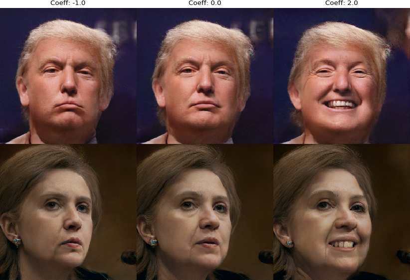

## StyleGAN &mdash; Encoder for Official TensorFlow Implementation


*This is my StyleGAN Encoder; there are many like it, but this one is mine. Thanks to @Puzer for the original, of which this is a fork, and to @SimJeg for the initial code that formed the basis of the ResNet model used here, and to @Pender for his fork as well!*


From left to right: original image, predicted image from a ResNet trained on generated StyleGAN faces, and the final encoded image.

What I've added:

1) The ResNet encoder - train your own with *train_resnet.py* or [download my pre-trained model](https://drive.google.com/open?id=1aT59NFy9-bNyXjDuZOTMl0qX0jmZc6Zb)! Put the model in data/finetuned_resnet.h5
2) Drop-in replacement to use an EfficientNet based encoder with *train_effnet.py* - thanks to @qubvel for [his Keras implementation of EfficientNets](https://github.com/qubvel/efficientnet/)! Install from source to get the latest version.
3) More loss functions for the iterative encoder to improve convergence speed and face quality.
 * Original VGG loss is still present.
 * Added image loss using logcosh.
 * Added MS-SIM loss.
 * Added LPIPS loss (pretrained model included with StyleGAN)
 * Added L1 penalty on dlatents - this keeps the representation closer to StyleGAN's concept of faces.
4) Added support for generating **videos** of the encoding process!
5) Added learning rate decay, stochastic gradient clipping, and tiled dlatents from @Pender's StyleGAN encoder fork.
6) Adding experimental support for FP16 and [TreeConnect](https://github.com/OliverRichter/TreeConnect).
7) Added support for masking and autogenerating face masks
8) Merged support for conditional generation from @davidstap [StyleGAN fork](https://github.com/davidstap/stylegan)
9) Added support for stochastic weight averaging of StyleGAN checkpoints
10) A [tutorial notebook](https://github.com/pbaylies/stylegan-encoder/blob/master/StyleGAN_Encoder_Tutorial.ipynb)!
11) Follow @Puzer's instructions below for encoder usage as well, all of that still applies!

```
usage: encode_images.py [-h] [--data_dir DATA_DIR] [--mask_dir MASK_DIR]
                        [--load_last LOAD_LAST] [--dlatent_avg DLATENT_AVG]
                        [--model_url MODEL_URL] [--model_res MODEL_RES]
                        [--batch_size BATCH_SIZE] [--image_size IMAGE_SIZE]
                        [--resnet_image_size RESNET_IMAGE_SIZE] [--lr LR]
                        [--decay_rate DECAY_RATE] [--iterations ITERATIONS]
                        [--decay_steps DECAY_STEPS]
                        [--load_effnet LOAD_EFFNET]
                        [--load_resnet LOAD_RESNET]
                        [--use_vgg_loss USE_VGG_LOSS]
                        [--use_vgg_layer USE_VGG_LAYER]
                        [--use_pixel_loss USE_PIXEL_LOSS]
                        [--use_mssim_loss USE_MSSIM_LOSS]
                        [--use_lpips_loss USE_LPIPS_LOSS]
                        [--use_l1_penalty USE_L1_PENALTY]
                        [--randomize_noise RANDOMIZE_NOISE]
                        [--tile_dlatents TILE_DLATENTS]
                        [--clipping_threshold CLIPPING_THRESHOLD]
                        [--load_mask LOAD_MASK] [--face_mask FACE_MASK]
                        [--use_grabcut USE_GRABCUT] [--scale_mask SCALE_MASK]
                        [--video_dir VIDEO_DIR] [--output_video OUTPUT_VIDEO]
                        [--video_codec VIDEO_CODEC]
                        [--video_frame_rate VIDEO_FRAME_RATE]
                        [--video_size VIDEO_SIZE] [--video_skip VIDEO_SKIP]
                        src_dir generated_images_dir dlatent_dir

Find latent representation of reference images using perceptual losses

positional arguments:
  src_dir               Directory with images for encoding
  generated_images_dir  Directory for storing generated images
  dlatent_dir           Directory for storing dlatent representations

optional arguments:
  -h, --help                              show this help message and exit
  --data_dir DATA_DIR                     Directory for storing optional models (default: data)
  --load_last LOAD_LAST                   Start with embeddings from directory (default: )
  --model_url MODEL_URL                   Fetch a StyleGAN model to train on from this URL
                                (default: https://drive.google.com/uc?id=1MEGjdvVpUsu1jB4zrXZN7Y4kBBOzizDQ)
  --model_res MODEL_RES                   The dimension of images in the StyleGAN model (default: 1024)
  --batch_size BATCH_SIZE                 Batch size for generator and perceptual model (default: 1)
  --image_size IMAGE_SIZE                 Size of images for perceptual model (default: 256)
  --resnet_image_size RESNET_IMAGE_SIZE   Size of images for the Resnet model (default: 256)                        
  --lr LR                                 Learning rate for perceptual model (default: 0.02)
  --decay_rate DECAY_RATE                 Decay rate for learning rate (default: 0.9)
  --iterations ITERATIONS                 Number of optimization steps for each batch (default: 100)
  --decay_steps DECAY_STEPS               Decay steps for learning rate decay (as a percent of iterations) (default: 10)
  --load_resnet LOAD_RESNET               Model to load for Resnet approximation of dlatents
                                (default: data/finetuned_resnet.h5)
  --use_vgg_loss USE_VGG_LOSS             Use VGG perceptual loss; 0 to disable, > 0 to scale. (default: 0.4)
  --use_vgg_layer USE_VGG_LAYER           Pick which VGG layer to use. (default: 9)
  --use_pixel_loss USE_PIXEL_LOSS         Use logcosh image pixel loss; 0 to disable, > 0 to scale. (default: 1.5)
  --use_mssim_loss USE_MSSIM_LOSS         Use MS-SIM perceptual loss; 0 to disable, > 0 to scale. (default: 100)
  --use_lpips_loss USE_LPIPS_LOSS         Use LPIPS perceptual loss; 0 to disable, > 0 to scale. (default: 100)
  --use_l1_penalty USE_L1_PENALTY         Use L1 penalty on latents; 0 to disable, > 0 to scale. (default: 1)
  --randomize_noise RANDOMIZE_NOISE       Add noise to dlatents during optimization (default: False)
  --tile_dlatents TILE_DLATENTS           Tile dlatents to use a single vector at each scale (default: False)
  --clipping_threshold CLIPPING_THRESHOLD Stochastic clipping of gradient values outside of this threshold (default: 2.0)
  --load_mask LOAD_MASK Load segmentation masks (default: False)
  --face_mask FACE_MASK Generate a mask for predicting only the face area (default: False)
  --use_grabcut USE_GRABCUT Use grabcut algorithm on the face mask to better segment the foreground (default: True)
  --scale_mask SCALE_MASK Look over a wider section of foreground for grabcut (default: 1.5)
  --video_dir VIDEO_DIR                   Directory for storing training videos (default: videos)
  --output_video OUTPUT_VIDEO             Generate videos of the optimization process (default: False)
  --video_codec VIDEO_CODEC               FOURCC-supported video codec name (default: MJPG)
  --video_frame_rate VIDEO_FRAME_RATE     Video frames per second (default: 24)
  --video_size VIDEO_SIZE                 Video size in pixels (default: 512)
  --video_skip VIDEO_SKIP                 Only write every n frames (1 = write every frame) (default: 1)
```
---
```
usage: train_effnet.py [-h] [--model_url MODEL_URL] [--model_res MODEL_RES]
                       [--data_dir DATA_DIR] [--model_path MODEL_PATH]
                       [--model_depth MODEL_DEPTH] [--model_size MODEL_SIZE]
                       [--use_ktrain USE_KTRAIN]
                       [--ktrain_max_lr KTRAIN_MAX_LR]
                       [--ktrain_reduce_lr KTRAIN_REDUCE_LR]
                       [--ktrain_stop_early KTRAIN_STOP_EARLY]
                       [--activation ACTIVATION] [--optimizer OPTIMIZER]
                       [--loss LOSS] [--use_fp16 USE_FP16]
                       [--image_size IMAGE_SIZE] [--batch_size BATCH_SIZE]
                       [--test_size TEST_SIZE] [--truncation TRUNCATION]
                       [--fancy_truncation FANCY_TRUNCATION]
                       [--max_patience MAX_PATIENCE]
                       [--freeze_first FREEZE_FIRST] [--epochs EPOCHS]
                       [--minibatch_size MINIBATCH_SIZE] [--seed SEED]
                       [--loop LOOP]

Train an EfficientNet to predict latent representations of images in a
StyleGAN model from generated examples

optional arguments:
  -h, --help            show this help message and exit
  --model_url MODEL_URL
                        Fetch a StyleGAN model to train on from this URL
                        (default: https://drive.google.com/uc?id=1MEGjdvVpUsu1jB4zrXZN7Y4kBBOzizDQ)
  --model_res MODEL_RES
                        The dimension of images in the StyleGAN model (default: 1024)
  --data_dir DATA_DIR   Directory for storing the EfficientNet model (default: data)
  --model_path MODEL_PATH
                        Save / load / create the EfficientNet model with this file path (default: data/finetuned_effnet.h5)
  --model_depth MODEL_DEPTH
                        Number of TreeConnect layers to add after EfficientNet (default: 1)
  --model_size MODEL_SIZE
                        Model size - 0 - small, 1 - medium, 2 - large, or 3 - full size. (default: 1)
  --use_ktrain USE_KTRAIN
                        Use ktrain for training (default: False)
  --ktrain_max_lr KTRAIN_MAX_LR
                        Maximum learning rate for ktrain (default: 0.001)
  --ktrain_reduce_lr KTRAIN_REDUCE_LR
                        Patience for reducing learning rate after a plateau
                        for ktrain (default: 1)
  --ktrain_stop_early KTRAIN_STOP_EARLY
                        Patience for early stopping for ktrain (default: 3)
  --activation ACTIVATION
                        Activation function to use after EfficientNet (default: elu)
  --optimizer OPTIMIZER Optimizer to use (default: adam)
  --loss LOSS           Loss function to use (default: logcosh)
  --use_fp16 USE_FP16   Use 16-bit floating point (default: False)
  --image_size IMAGE_SIZE
                        Size of images for EfficientNet model (default: 256)
  --batch_size BATCH_SIZE
                        Batch size for training the EfficientNet model (default: 2048)
  --test_size TEST_SIZE
                        Batch size for testing the EfficientNet model (default: 512)
  --truncation TRUNCATION
                        Generate images using truncation trick (default: 0.7)
  --fancy_truncation FANCY_TRUNCATION
                        Use fancier truncation proposed by @oneiroid (default: True)
  --max_patience MAX_PATIENCE
                        Number of iterations to wait while test loss does not improve (default: 2)
  --freeze_first FREEZE_FIRST
                        Start training with the pre-trained network frozen, then unfreeze (default: False)
  --epochs EPOCHS       Number of training epochs to run for each batch (default: 2)
  --minibatch_size MINIBATCH_SIZE
                        Size of minibatches for training and generation (default: 16)
  --seed SEED           Pick a random seed for reproducibility (-1 for no random seed selected) (default: -1)
  --loop LOOP           Run this many iterations (-1 for infinite, halt with CTRL-C) (default: -1)
```
---
```
usage: train_resnet.py [-h] [--model_url MODEL_URL] [--model_res MODEL_RES]
                       [--data_dir DATA_DIR] [--model_path MODEL_PATH]
                       [--model_depth MODEL_DEPTH] [--model_size MODEL_SIZE]
                       [--activation ACTIVATION] [--use_fp16 USE_FP16]
                       [--image_size IMAGE_SIZE] [--batch_size BATCH_SIZE]
                       [--test_size TEST_SIZE] [--max_patience MAX_PATIENCE]
                       [--freeze_first FREEZE_FIRST] [--epochs EPOCHS]
                       [--minibatch_size MINIBATCH_SIZE] [--seed SEED]
                       [--loop LOOP]

Train a ResNet to predict latent representations of images in a StyleGAN model
from generated examples

optional arguments:
  -h, --help            show this help message and exit
  --model_url MODEL_URL
                        Fetch a StyleGAN model to train on from this URL
                        (default: https://drive.google.com/uc?id=1MEGjdvVpUsu1jB4zrXZN7Y4kBBOzizDQ)
  --model_res MODEL_RES
                        The dimension of images in the StyleGAN model (default: 1024)
  --data_dir DATA_DIR   Directory for storing the ResNet model (default: data)
  --model_path MODEL_PATH
                        Save / load / create the ResNet model with this file path (default: data/finetuned_resnet.h5)
  --use_fp16 USE_FP16   Use 16-bit floating point (default: False)
  --model_depth MODEL_DEPTH
                        Number of TreeConnect layers to add after ResNet (default: 1)
  --model_size MODEL_SIZE
                        Model size - 0 - small, 1 - medium, 2 - large. (default: 0)
  --activation ACTIVATION
                        Activation function to use after ResNet (default: elu)
  --image_size IMAGE_SIZE
                        Size of images for ResNet model (default: 256)
  --batch_size BATCH_SIZE
                        Batch size for training the ResNet model (default: 2048)
  --test_size TEST_SIZE
                        Batch size for testing the ResNet model (default: 512)
  --max_patience MAX_PATIENCE
                        Number of iterations to wait while test loss does not improve (default: 2)
  --freeze_first FREEZE_FIRST
                        Start training with the pre-trained network frozen, then unfreeze (default: False)
  --epochs EPOCHS       Number of training epochs to run for each batch (default: 2)
  --minibatch_size MINIBATCH_SIZE
                        Size of minibatches for training and generation (default: 16)
  --seed SEED           Pick a random seed for reproducibility (-1 for no random seed selected) (default: -1)
  --loop LOOP           Run this many iterations (-1 for infinite, halt with CTRL-C) (default: -1)
```
---
```
usage: swa.py [-h] [--filespec FILESPEC] [--output_model OUTPUT_MODEL]
              [--count COUNT]
              results_dir

Perform stochastic weight averaging

positional arguments:
  results_dir           Directory with network checkpoints for weight
                        averaging

optional arguments:
  -h, --help            show this help message and exit
  --filespec FILESPEC   The files to average (default: network*.pkl)
  --output_model OUTPUT_MODEL
                        The averaged model to output (default:
                        network_avg.pkl)
  --count COUNT         Average the last n checkpoints (default: 6)
```
---
```
usage: align_images.py [-h] [--output_size OUTPUT_SIZE] [--x_scale X_SCALE]
                       [--y_scale Y_SCALE] [--em_scale EM_SCALE]
                       raw_dir aligned_dir

Align faces from input images

positional arguments:
  raw_dir               Directory with raw images for face alignment
  aligned_dir           Directory for storing aligned images

optional arguments:
  -h, --help            show this help message and exit
  --output_size OUTPUT_SIZE
                        The dimension of images for input to the model
                        (default: 1024)
  --x_scale X_SCALE     Scaling factor for x dimension (default: 1)
  --y_scale Y_SCALE     Scaling factor for y dimension (default: 1)
  --em_scale EM_SCALE   Scaling factor for eye-mouth distance (default: 0.1)
```
---


*These people are real &ndash; latent representation of them was found by using perceptual loss trick. Then this representations were moved along "smiling direction" and transformed back into images*

Short explanation of encoding approach:
0) Original pre-trained StyleGAN generator is used for generating images
1) Pre-trained VGG16 network is used for transforming a reference image and generated image into high-level features space
2) Loss is calculated as a difference between them in the features space
3) Optimization is performed only for latent representation which we want to obtain. 
4) Upon completion of optimization you are able to transform your latent vector as you wish. For example you can find a "smiling direction" in your latent space, move your latent vector in this direction and transform it back to image using the generator. 

**New scripts for finding your own directions will be realised soon. For now you can play with existing ones: smiling, age, gender.**
**More examples you can find in the [Jupyter notebook](https://github.com/Puzer/stylegan/blob/master/Play_with_latent_directions.ipynb)**

### Generating latent representation of your images
You can generate latent representations of your own images using two scripts:
1) Extract and align faces from images
> python align_images.py raw_images/ aligned_images/

2) Find latent representation of aligned images
> python encode_images.py aligned_images/ generated_images/ latent_representations/

3) Then you can play with [Jupyter notebook](https://github.com/Puzer/stylegan/blob/master/Play_with_latent_directions.ipynb)

Feel free to join the research. There is still much room for improvement:
1) Better model for perceptual loss
2) Is it possible to generate latent representations by using other model instead of direct optimization ? (WIP)

Stay tuned!

### Original Readme:
This repository contains (no longer) official TensorFlow implementation of the following paper:


> **A Style-Based Generator Architecture for Generative Adversarial Networks**<br>
> Tero Karras (NVIDIA), Samuli Laine (NVIDIA), Timo Aila (NVIDIA)<br>
> http://stylegan.xyz/paper
>
> **Abstract:** *We propose an alternative generator architecture for generative adversarial networks, borrowing from style transfer literature. The new architecture leads to an automatically learned, unsupervised separation of high-level attributes (e.g., pose and identity when trained on human faces) and stochastic variation in the generated images (e.g., freckles, hair), and it enables intuitive, scale-specific control of the synthesis. The new generator improves the state-of-the-art in terms of traditional distribution quality metrics, leads to demonstrably better interpolation properties, and also better disentangles the latent factors of variation. To quantify interpolation quality and disentanglement, we propose two new, automated methods that are applicable to any generator architecture. Finally, we introduce a new, highly varied and high-quality dataset of human faces.*

For business inquiries, please contact [researchinquiries@nvidia.com](mailto:researchinquiries@nvidia.com)

For press and other inquiries, please contact Hector Marinez at [hmarinez@nvidia.com](mailto:hmarinez@nvidia.com)

## Resources

All material related to our paper is available via the following links:

| Link                      | Description
| :--------------           | :----------
| http://stylegan.xyz/paper | Paper PDF.
| http://stylegan.xyz/video | Result video.
| http://stylegan.xyz/code  | Source code.
| http://stylegan.xyz/ffhq  | Flickr-Faces-HQ dataset.
| http://stylegan.xyz/drive | Google Drive folder.

Additional material can be found in Google Drive folder:

| Path | Description
| :--- | :----------
| [StyleGAN](http://stylegan.xyz/drive) | Main folder.
| &boxvr;&nbsp; [stylegan-paper.pdf](https://drive.google.com/open?id=1v-HkF3Ehrpon7wVIx4r5DLcko_U_V6Lt) | High-quality version of the paper PDF.
| &boxvr;&nbsp; [stylegan-video.mp4](https://drive.google.com/open?id=1uzwkZHQX_9pYg1i0d1Nbe3D9xPO8-qBf) | High-quality version of the result video.
| &boxvr;&nbsp; [images](https://drive.google.com/open?id=1-l46akONUWF6LCpDoeq63H53rD7MeiTd) | Example images produced by our generator.
| &boxv;&nbsp; &boxvr;&nbsp; [representative-images](https://drive.google.com/open?id=1ToY5P4Vvf5_c3TyUizQ8fckFFoFtBvD8) | High-quality images to be used in articles, blog posts, etc.
| &boxv;&nbsp; &boxur;&nbsp; [100k-generated-images](https://drive.google.com/open?id=100DJ0QXyG89HZzB4w2Cbyf4xjNK54cQ1) | 100,000 generated images for different amounts of truncation.
| &boxv;&nbsp; &ensp;&ensp; &boxvr;&nbsp; [ffhq-1024x1024](https://drive.google.com/open?id=14lm8VRN1pr4g_KVe6_LvyDX1PObst6d4) | Generated using Flickr-Faces-HQ at 1024&times;1024.
| &boxv;&nbsp; &ensp;&ensp; &boxvr;&nbsp; [bedrooms-256x256](https://drive.google.com/open?id=1Vxz9fksw4kgjiHrvHkX4Hze4dyThFW6t) | Generated using LSUN Bedroom at 256&times;256.
| &boxv;&nbsp; &ensp;&ensp; &boxvr;&nbsp; [cars-512x384](https://drive.google.com/open?id=1MFCvOMdLE2_mpeLPTiDw5dxc2CRuKkzS) | Generated using LSUN Car at 512&times;384.
| &boxv;&nbsp; &ensp;&ensp; &boxur;&nbsp; [cats-256x256](https://drive.google.com/open?id=1gq-Gj3GRFiyghTPKhp8uDMA9HV_0ZFWQ) | Generated using LSUN Cat at 256&times;256.
| &boxvr;&nbsp; [videos](https://drive.google.com/open?id=1N8pOd_Bf8v89NGUaROdbD8-ayLPgyRRo) | Example videos produced by our generator.
| &boxv;&nbsp; &boxur;&nbsp; [high-quality-video-clips](https://drive.google.com/open?id=1NFO7_vH0t98J13ckJYFd7kuaTkyeRJ86) | Individual segments of the result video as high-quality MP4.
| &boxvr;&nbsp; [ffhq-dataset](https://drive.google.com/open?id=1u2xu7bSrWxrbUxk-dT-UvEJq8IjdmNTP) | Raw data for the [Flickr-Faces-HQ dataset](http://stylegan.xyz/ffhq).
| &boxur;&nbsp; [networks](https://drive.google.com/open?id=1MASQyN5m0voPcx7-9K0r5gObhvvPups7) | Pre-trained networks as pickled instances of [dnnlib.tflib.Network](./dnnlib/tflib/network.py).
| &ensp;&ensp; &boxvr;&nbsp; [stylegan-ffhq-1024x1024.pkl](https://drive.google.com/uc?id=1MEGjdvVpUsu1jB4zrXZN7Y4kBBOzizDQ) | StyleGAN trained with Flickr-Faces-HQ dataset at 1024&times;1024.
| &ensp;&ensp; &boxvr;&nbsp; [stylegan-celebahq-1024x1024.pkl](https://drive.google.com/uc?id=1MGqJl28pN4t7SAtSrPdSRJSQJqahkzUf) | StyleGAN trained with CelebA-HQ dataset at 1024&times;1024.
| &ensp;&ensp; &boxvr;&nbsp; [stylegan-bedrooms-256x256.pkl](https://drive.google.com/uc?id=1MOSKeGF0FJcivpBI7s63V9YHloUTORiF) | StyleGAN trained with LSUN Bedroom dataset at 256&times;256.
| &ensp;&ensp; &boxvr;&nbsp; [stylegan-cars-512x384.pkl](https://drive.google.com/uc?id=1MJ6iCfNtMIRicihwRorsM3b7mmtmK9c3) | StyleGAN trained with LSUN Car dataset at 512&times;384.
| &ensp;&ensp; &boxvr;&nbsp; [stylegan-cats-256x256.pkl](https://drive.google.com/uc?id=1MQywl0FNt6lHu8E_EUqnRbviagS7fbiJ) | StyleGAN trained with LSUN Cat dataset at 256&times;256.
| &ensp;&ensp; &boxur;&nbsp; [metrics](https://drive.google.com/open?id=1MvYdWCBuMfnoYGptRH-AgKLbPTsIQLhl) | Auxiliary networks for the quality and disentanglement metrics.
| &ensp;&ensp; &ensp;&ensp; &boxvr;&nbsp; [inception_v3_features.pkl](https://drive.google.com/uc?id=1MzTY44rLToO5APn8TZmfR7_ENSe5aZUn) | Standard [Inception-v3](https://arxiv.org/abs/1512.00567) classifier that outputs a raw feature vector.
| &ensp;&ensp; &ensp;&ensp; &boxvr;&nbsp; [vgg16_zhang_perceptual.pkl](https://drive.google.com/uc?id=1N2-m9qszOeVC9Tq77WxsLnuWwOedQiD2) | Standard [LPIPS](https://arxiv.org/abs/1801.03924) metric to estimate perceptual similarity.
| &ensp;&ensp; &ensp;&ensp; &boxvr;&nbsp; [celebahq-classifier-00-male.pkl](https://drive.google.com/uc?id=1Q5-AI6TwWhCVM7Muu4tBM7rp5nG_gmCX) | Binary classifier trained to detect a single attribute of CelebA-HQ.
| &ensp;&ensp; &ensp;&ensp; &boxur;&nbsp;&#x22ef; | Please see the file listing for remaining networks.

## Licenses

All material, excluding the Flickr-Faces-HQ dataset, is made available under [Creative Commons BY-NC 4.0](https://creativecommons.org/licenses/by-nc/4.0/) license by NVIDIA Corporation. You can **use, redistribute, and adapt** the material for **non-commercial purposes**, as long as you give appropriate credit by **citing our paper** and **indicating any changes** that you've made.

For license information regarding the FFHQ dataset, please refer to the [Flickr-Faces-HQ repository](http://stylegan.xyz/ffhq).

`inception_v3_features.pkl` and `inception_v3_softmax.pkl` are derived from the pre-trained [Inception-v3](https://arxiv.org/abs/1512.00567) network by Christian Szegedy, Vincent Vanhoucke, Sergey Ioffe, Jonathon Shlens, and Zbigniew Wojna. The network was originally shared under [Apache 2.0](https://github.com/tensorflow/models/blob/master/LICENSE) license on the [TensorFlow Models](https://github.com/tensorflow/models) repository.

`vgg16.pkl` and `vgg16_zhang_perceptual.pkl` are derived from the pre-trained [VGG-16](https://arxiv.org/abs/1409.1556) network by Karen Simonyan and Andrew Zisserman. The network was originally shared under [Creative Commons BY 4.0](https://creativecommons.org/licenses/by/4.0/) license on the [Very Deep Convolutional Networks for Large-Scale Visual Recognition](http://www.robots.ox.ac.uk/~vgg/research/very_deep/) project page.

`vgg16_zhang_perceptual.pkl` is further derived from the pre-trained [LPIPS](https://arxiv.org/abs/1801.03924) weights by Richard Zhang, Phillip Isola, Alexei A. Efros, Eli Shechtman, and Oliver Wang. The weights were originally shared under [BSD 2-Clause "Simplified" License](https://github.com/richzhang/PerceptualSimilarity/blob/master/LICENSE) on the [PerceptualSimilarity](https://github.com/richzhang/PerceptualSimilarity) repository.

## System requirements

* Both Linux and Windows are supported, but we strongly recommend Linux for performance and compatibility reasons.
* 64-bit Python 3.6 installation. We recommend Anaconda3 with numpy 1.14.3 or newer.
* TensorFlow 1.10.0 or newer with GPU support.
* One or more high-end NVIDIA GPUs with at least 11GB of DRAM. We recommend NVIDIA DGX-1 with 8 Tesla V100 GPUs.
* NVIDIA driver 391.35 or newer, CUDA toolkit 9.0 or newer, cuDNN 7.3.1 or newer.

## Using pre-trained networks

A minimal example of using a pre-trained StyleGAN generator is given in [pretrained_example.py](./pretrained_example.py). When executed, the script downloads a pre-trained StyleGAN generator from Google Drive and uses it to generate an image:

```
> python pretrained_example.py
Downloading https://drive.google.com/uc?id=1MEGjdvVpUsu1jB4zrXZN7Y4kBBOzizDQ .... done

Gs                              Params    OutputShape          WeightShape
---                             ---       ---                  ---
latents_in                      -         (?, 512)             -
...
images_out                      -         (?, 3, 1024, 1024)   -
---                             ---       ---                  ---
Total                           26219627

> ls results
example.png # https://drive.google.com/uc?id=1UDLT_zb-rof9kKH0GwiJW_bS9MoZi8oP
```

A more advanced example is given in [generate_figures.py](./generate_figures.py). The script reproduces the figures from our paper in order to illustrate style mixing, noise inputs, and truncation:
```
> python generate_figures.py
results/figure02-uncurated-ffhq.png     # https://drive.google.com/uc?id=1U3r1xgcD7o-Fd0SBRpq8PXYajm7_30cu
results/figure03-style-mixing.png       # https://drive.google.com/uc?id=1U-nlMDtpnf1RcYkaFQtbh5oxnhA97hy6
results/figure04-noise-detail.png       # https://drive.google.com/uc?id=1UX3m39u_DTU6eLnEW6MqGzbwPFt2R9cG
results/figure05-noise-components.png   # https://drive.google.com/uc?id=1UQKPcvYVeWMRccGMbs2pPD9PVv1QDyp_
results/figure08-truncation-trick.png   # https://drive.google.com/uc?id=1ULea0C12zGlxdDQFNLXOWZCHi3QNfk_v
results/figure10-uncurated-bedrooms.png # https://drive.google.com/uc?id=1UEBnms1XMfj78OHj3_cx80mUf_m9DUJr
results/figure11-uncurated-cars.png     # https://drive.google.com/uc?id=1UO-4JtAs64Kun5vIj10UXqAJ1d5Ir1Ke
results/figure12-uncurated-cats.png     # https://drive.google.com/uc?id=1USnJc14prlu3QAYxstrtlfXC9sDWPA-W
```

The pre-trained networks are stored as standard pickle files on Google Drive:

```
# Load pre-trained network.
url = 'https://drive.google.com/uc?id=1MEGjdvVpUsu1jB4zrXZN7Y4kBBOzizDQ' # karras2019stylegan-ffhq-1024x1024.pkl
with dnnlib.util.open_url(url, cache_dir=config.cache_dir) as f:
    _G, _D, Gs = pickle.load(f)
    # _G = Instantaneous snapshot of the generator. Mainly useful for resuming a previous training run.
    # _D = Instantaneous snapshot of the discriminator. Mainly useful for resuming a previous training run.
    # Gs = Long-term average of the generator. Yields higher-quality results than the instantaneous snapshot.
```

The above code downloads the file and unpickles it to yield 3 instances of [dnnlib.tflib.Network](./dnnlib/tflib/network.py). To generate images, you will typically want to use `Gs` &ndash; the other two networks are provided for completeness. In order for `pickle.load()` to work, you will need to have the `dnnlib` source directory in your PYTHONPATH and a `tf.Session` set as default. The session can initialized by calling `dnnlib.tflib.init_tf()`.

There are three ways to use the pre-trained generator:

1. Use `Gs.run()` for immediate-mode operation where the inputs and outputs are numpy arrays:
   ```
   # Pick latent vector.
   rnd = np.random.RandomState(5)
   latents = rnd.randn(1, Gs.input_shape[1])

   # Generate image.
   fmt = dict(func=tflib.convert_images_to_uint8, nchw_to_nhwc=True)
   images = Gs.run(latents, None, truncation_psi=0.7, randomize_noise=True, output_transform=fmt)
   ```
   The first argument is a batch of latent vectors of shape `[num, 512]`. The second argument is reserved for class labels (not used by StyleGAN). The remaining keyword arguments are optional and can be used to further modify the operation (see below). The output is a batch of images, whose format is dictated by the `output_transform` argument.

2. Use `Gs.get_output_for()` to incorporate the generator as a part of a larger TensorFlow expression:
   ```
   latents = tf.random_normal([self.minibatch_per_gpu] + Gs_clone.input_shape[1:])
   images = Gs_clone.get_output_for(latents, None, is_validation=True, randomize_noise=True)
   images = tflib.convert_images_to_uint8(images)
   result_expr.append(inception_clone.get_output_for(images))
   ```
   The above code is from [metrics/frechet_inception_distance.py](./metrics/frechet_inception_distance.py). It generates a batch of random images and feeds them directly to the [Inception-v3](https://arxiv.org/abs/1512.00567) network without having to convert the data to numpy arrays in between.

3. Look up `Gs.components.mapping` and `Gs.components.synthesis` to access individual sub-networks of the generator. Similar to `Gs`, the sub-networks are represented as independent instances of [dnnlib.tflib.Network](./dnnlib/tflib/network.py):
   ```
   src_latents = np.stack(np.random.RandomState(seed).randn(Gs.input_shape[1]) for seed in src_seeds)
   src_dlatents = Gs.components.mapping.run(src_latents, None) # [seed, layer, component]
   src_images = Gs.components.synthesis.run(src_dlatents, randomize_noise=False, **synthesis_kwargs)
   ```
   The above code is from [generate_figures.py](./generate_figures.py). It first transforms a batch of latent vectors into the intermediate *W* space using the mapping network and then turns these vectors into a batch of images using the synthesis network. The `dlatents` array stores a separate copy of the same *w* vector for each layer of the synthesis network to facilitate style mixing.

The exact details of the generator are defined in [training/networks_stylegan.py](./training/networks_stylegan.py) (see `G_style`, `G_mapping`, and `G_synthesis`). The following keyword arguments can be specified to modify the behavior when calling `run()` and `get_output_for()`:

* `truncation_psi` and `truncation_cutoff` control the truncation trick that that is performed by default when using `Gs` (&psi;=0.7, cutoff=8). It can be disabled by setting `truncation_psi=1` or `is_validation=True`, and the image quality can be further improved at the cost of variation by setting e.g. `truncation_psi=0.5`. Note that truncation is always disabled when using the sub-networks directly. The average *w* needed to manually perform the truncation trick can be looked up using `Gs.get_var('dlatent_avg')`.

* `randomize_noise` determines whether to use re-randomize the noise inputs for each generated image (`True`, default) or whether to use specific noise values for the entire minibatch (`False`). The specific values can be accessed via the `tf.Variable` instances that are found using `[var for name, var in Gs.components.synthesis.vars.items() if name.startswith('noise')]`.

* When using the mapping network directly, you can specify `dlatent_broadcast=None` to disable the automatic duplication of `dlatents` over the layers of the synthesis network.

* Runtime performance can be fine-tuned via `structure='fixed'` and `dtype='float16'`. The former disables support for progressive growing, which is not needed for a fully-trained generator, and the latter performs all computation using half-precision floating point arithmetic.

## Preparing datasets for training

The training and evaluation scripts operate on datasets stored as multi-resolution TFRecords. Each dataset is represented by a directory containing the same image data in several resolutions to enable efficient streaming. There is a separate *.tfrecords file for each resolution, and if the dataset contains labels, they are stored in a separate file as well. By default, the scripts expect to find the datasets at `datasets/<NAME>/<NAME>-<RESOLUTION>.tfrecords`. The directory can be changed by editing [config.py](./config.py):

```
result_dir = 'results'
data_dir = 'datasets'
cache_dir = 'cache'
```

To obtain the FFHQ dataset (`datasets/ffhq`), please refer to the [Flickr-Faces-HQ repository](http://stylegan.xyz/ffhq).

To obtain the CelebA-HQ dataset (`datasets/celebahq`), please refer to the [Progressive GAN repository](https://github.com/tkarras/progressive_growing_of_gans).

To obtain other datasets, including LSUN, please consult their corresponding project pages. The datasets can be converted to multi-resolution TFRecords using the provided [dataset_tool.py](./dataset_tool.py):

```
> python dataset_tool.py create_lsun datasets/lsun-bedroom-full ~/lsun/bedroom_lmdb --resolution 256
> python dataset_tool.py create_lsun_wide datasets/lsun-car-512x384 ~/lsun/car_lmdb --width 512 --height 384
> python dataset_tool.py create_lsun datasets/lsun-cat-full ~/lsun/cat_lmdb --resolution 256
> python dataset_tool.py create_cifar10 datasets/cifar10 ~/cifar10
> python dataset_tool.py create_from_images datasets/custom-dataset ~/custom-images
```

## Training networks

Once the datasets are set up, you can train your own StyleGAN networks as follows:

1. Edit [train.py](./train.py) to specify the dataset and training configuration by uncommenting or editing specific lines.
2. Run the training script with `python train.py`.
3. The results are written to a newly created directory `results/<ID>-<DESCRIPTION>`.
4. The training may take several days (or weeks) to complete, depending on the configuration.

By default, `train.py` is configured to train the highest-quality StyleGAN (configuration F in Table 1) for the FFHQ dataset at 1024&times;1024 resolution using 8 GPUs. Please note that we have used 8 GPUs in all of our experiments. Training with fewer GPUs may not produce identical results &ndash; if you wish to compare against our technique, we strongly recommend using the same number of GPUs.

Expected training time for 1024&times;1024 resolution using Tesla V100 GPUs:

| GPUs | Training time
| :--: | :------------
| 1    | 5 weeks
| 2    | 3 weeks
| 4    | 2 weeks
| 8    | 1 week

## Evaluating quality and disentanglement

The quality and disentanglement metrics used in our paper can be evaluated using [run_metrics.py](./run_metrics.py). By default, the script will evaluate the Fr&eacute;chet Inception Distance (`fid50k`) for the pre-trained FFHQ generator and write the results into a newly created directory under `results`. The exact behavior can be changed by uncommenting or editing specific lines in [run_metrics.py](./run_metrics.py).

Expected evaluation time and results for the pre-trained FFHQ generator using one Tesla V100 GPU:

| Metric    | Time      | Result   | Description
| :-----    | :---      | :-----   | :----------
| fid50k    | 16 min    | 4.4159   | Fr&eacute;chet Inception Distance using 50,000 images.
| ppl_zfull | 55 min    | 664.8854 | Perceptual Path Length for full paths in *Z*.
| ppl_wfull | 55 min    | 233.3059 | Perceptual Path Length for full paths in *W*.
| ppl_zend  | 55 min    | 666.1057 | Perceptual Path Length for path endpoints in *Z*.
| ppl_wend  | 55 min    | 197.2266 | Perceptual Path Length for path endpoints in *W*.
| ls        | 10 hours  | z: 165.0106<br>w: 3.7447 | Linear Separability in *Z* and *W*.

Please note that the exact results may vary from run to run due to the non-deterministic nature of TensorFlow.

## Acknowledgements

We thank Jaakko Lehtinen, David Luebke, and Tuomas Kynk&auml;&auml;nniemi for in-depth discussions and helpful comments; Janne Hellsten, Tero Kuosmanen, and Pekka J&auml;nis for compute infrastructure and help with the code release.
